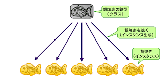

# Python爆速チュートリアル
基本的な内容はぶっ飛ばして応用に近い内容を説明する。

# 目次

[クラス](#クラス)

[エラーの読み方](#エラーの読み方)

[GitHubの使い方](#GitHubの使い方)

# クラス
クラスは厳密に言うと「分類」だけど、初心者の段階ではたい焼きのたとえでいいと思う。

## たい焼きのたとえ



各インスタンスで中身を変えることで、それぞれの状況に合う。（独自性の確保）

## 使い道

- データや関数をまとめたい場合
- たくさんの変数を管理するとき

## 継承

たとえば、

- あるクラスに必要な機能が大方あって少し手直しすればいいという場合
- 必要なデータ以外は実装しない場合

に使う。

```py
class Taiyaki:
    def __init__(self):
        self.contents = "None"

    def show(self):
        print(self.contents)

nomal = Taiyaki("小豆")
nomal.show()
```
小豆  

と表示される。

中身を変えるには、
```py

cream = Taiyaki("クリーム")
cream.show()
```
クリーム  

と表示される。
これにソースをかけるには、

```py
class Source(Taiyaki):
    def in_source(self, src_name):
        print(src_name + "をかけた")

with_source = Source()
with_source.in_source("苺ソース")
```
苺ソースをかけた

と出力される。

# エラーの読み方

実際のコード
```py

chars = "abc"
for char of chars:
    print(char, end="")

```
最後のエラー出力
```

Traceback (most recent call last):
  File "/home/kousei/.vscode/extensions/ms-python.python-2019.6.24221/pythonFiles/ptvsd_launcher.py", line 43, in <module>
    main(ptvsdArgs)
  File "/home/kousei/.vscode/extensions/ms-python.python-2019.6.24221/pythonFiles/lib/python/ptvsd/__main__.py", line 434, in main
    run()
  File "/home/kousei/.vscode/extensions/ms-python.python-2019.6.24221/pythonFiles/lib/python/ptvsd/__main__.py", line 312, in run_file
    runpy.run_path(target, run_name='__main__')
  File "/usr/lib/python3.7/runpy.py", line 261, in run_path
    code, fname = _get_code_from_file(run_name, path_name)
  File "/usr/lib/python3.7/runpy.py", line 236, in _get_code_from_file
    code = compile(f.read(), fname, 'exec')
  File "/home/kousei/Documents/Python/kuest/kuest/test.py", line 3
    for char of chars:
              ^
SyntaxError: invalid syntax
```
最後の
```
 File "/home/kousei/Documents/Python/kuest/kuest/test.py", line 3
    for char of chars:
              ^
SyntaxError: invalid syntax
```
に注目
File ~
はエラーがあるファイルとエラーが起きた行番号をしましている。
その下に該当のコードが出力される。
さらににその下は発生したエラーが表示される。
この場合は構文エラーで、inをofと間違えている。

**よくわからないエラーが出たら、Traceback~をコピーしてGoogle翻訳で翻訳してみるといい**
**最悪よくわからなかったら、エラーが出たコードとエラーメッセージを僕にLINEかlessueで送る。**

# GitHubの使い方

管理をするところは飛ばす

## lessueの使い方

**一言で言うと「報告」**
lessueとは、バグの報告やプロジェクトに関することを聞くための機能。
題名に大まかな説明を書き、その後詳しく起きたことなどを書く。

書く内容としては、

- 起きたこと
- 自分の環境（使っているエディターやインタプリタのバージョン）
- 書いたコード

を書く。


## Pull Request

**一言で言うと「修正」**
lessueで報告されたバグを修正したものを適用してよいか聞くための機能
許可されるとマージされる。

## Git用語集

| 用語 | 意味 |
| ----| ---- |
|マージ| まとめる。他の人変更を取り入れるときに使う|
|フェッチ|他の人変更を見るときに使う。|
|プル|フェッチとマージを一度にする。大抵これを使う。|
|リポジトリ|貯蔵庫。コードが保管してある。ローカルとリモートがある。|
|ローカルリポジトリ|ローカルにあるリポジトリ。ここで作業をする。|
|リモートリポジトリ|リモートにあるリポジトリ。メンバーのした変更がここに集まる。|
|ブランチ|履歴の流れを分岐して記録していくためのもの。|
|コミット|編集した内容を保存すること。リモートでのコミットはプッシュ|


初心者が行うべき流れ
```
     |-->Pull
     |    |
     |  作業
     |    |
     |    |
     |  commit
     |    |
     |<-Push
```
他に聞きたいことがあったり、このドキュメントでわからないことがあったらlessueを送る。
